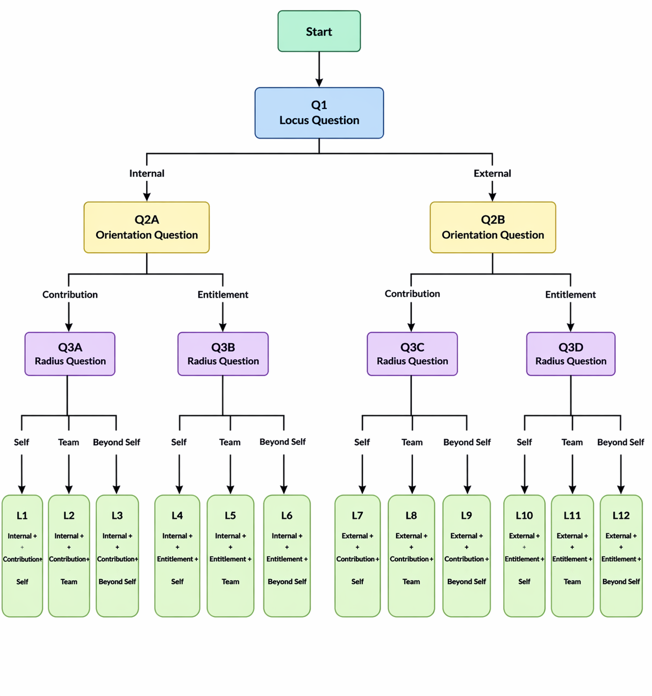

[code.py](https://github.com/user-attachments/files/27006321/code.py)
# Daily Reflection Tree

This project is part of the recruitment assignment from DT CultureTech.It represents a structured **decision-making and reflection system** using a tree-based model.

---

## Overview

The **Daily Reflection Tree** is a structured framework designed to analyze thoughts, decisions, and behaviors through a sequence of guided questions.

It helps in:
- Improving self-awareness  
- Understanding decision patterns  
- Building a growth mindset  
- Structuring reflections logically  

This system follows a **tree structure**, where each level represents a deeper layer of reflection.

---

## Tree Structure Explanation

The reflection process is divided into **3 levels**:

### Locus Question (Q1)
Determines the source of control:
- **Internal** → You are responsible  
- **External** → Outside factors influence  

---

### Orientation Question (Q2)
Defines your mindset:
- **Contribution** → Giving / adding value  
- **Entitlement** → Expecting / receiving  

---

### Radius Question (Q3)
Defines the scope of impact:
- **Self** → Personal level  
- **Team** → Group level  
- **Beyond Self** → Society / broader impact  

---

## Final Outcomes (Leaf Nodes)

Based on the combination of answers, we get **12 possible reflection outcomes**:

| Code | Meaning |
|------|--------|
| L1 | Internal + Contribution + Self |
| L2 | Internal + Contribution + Team |
| L3 | Internal + Contribution + Beyond Self |
| L4 | Internal + Entitlement + Self |
| L5 | Internal + Entitlement + Team |
| L6 | Internal + Entitlement + Beyond Self |
| L7 | External + Contribution + Self |
| L8 | External + Contribution + Team |
| L9 | External + Contribution + Beyond Self |
| L10 | External + Entitlement + Self |
| L11 | External + Entitlement + Team |
| L12 | External + Entitlement + Beyond Self |

---

## Diagram Representation

Below is the visual representation of the tree:

> *(Upload your generated image as `diagram.png` in the repo)*

---

## How It Works

1. Start with a situation or reflection  
2. Answer the **Locus Question**  
3. Move to **Orientation Question**  
4. Then answer the **Radius Question**  
5. Reach a final category (L1–L12)  

This helps classify your thinking pattern and improve decision-making.

---

## Use Cases

- Daily journaling  
- Behavioral analysis  
- Personal growth tracking  
- Team reflection exercises  
- Leadership development  

---

## Future Improvements

- Interactive UI for reflections  
- Data tracking & analytics  
- Integration with journaling apps  

---

## Reference

Assignment Source:  
DT CultureTech Recruitment Assignment  

---

